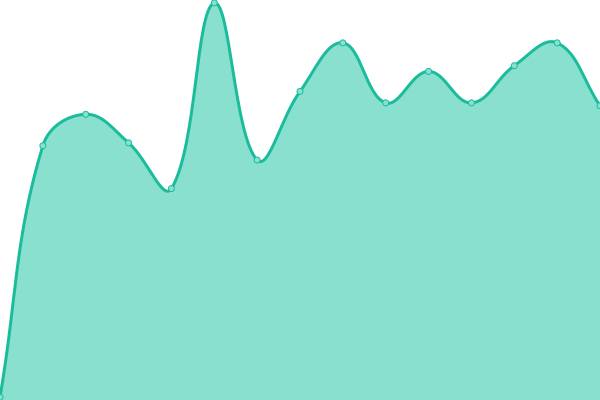

# 

<!--start: status pages-->
<!-- This summary is generated by Upptime (https://github.com/upptime/upptime) -->
<!-- Do not edit this manually, your changes will be overwritten -->
<!-- prettier-ignore -->
| URL | Status | Povijest | Vrijeme odziva | uptime |
| --- | ------ | ------- | ------------- | ------ |
|  [mopping.hr](https://mopping.hr) | Nedostupno | [mopping-hr.yml](https://github.com/Illyricon/mopping-status/commits/HEAD/history/mopping-hr.yml) | 

 117ms
     
 | 

<a href="https://status.mopping.hr/history/mopping-hr">99.31%</a>
    

<!--end: status pages-->

[**Posjeti status stranicu →**](https://status.mopping.hr)
